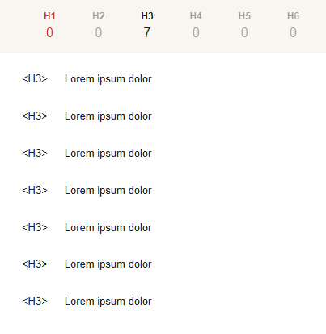

# React + Vite

This template provides a minimal setup to get React working in Vite with HMR and some ESLint rules.

Currently, two official plugins are available:

- [@vitejs/plugin-react](https://github.com/vitejs/vite-plugin-react/blob/main/packages/plugin-react) uses [Babel](https://babeljs.io/) for Fast Refresh
- [@vitejs/plugin-react-swc](https://github.com/vitejs/vite-plugin-react/blob/main/packages/plugin-react-swc) uses [SWC](https://swc.rs/) for Fast Refresh

## Expanding the ESLint configuration

If you are developing a production application, we recommend using TypeScript with type-aware lint rules enabled. Check out the [TS template](https://github.com/vitejs/vite/tree/main/packages/create-vite/template-react-ts) for information on how to integrate TypeScript and [`typescript-eslint`](https://typescript-eslint.io) in your project.

# Requisitos:
- [!] Desenvolvimento de um arquivo HTML e CSS a partir dos mockups apresentados;
- [x] Utilização de um repositório git remoto durante o desenvolvimento;
- [!] O menu deve continuar fixo a medida que usuário desce a tela;
- [!] Não há necessidade de criação de nenhuma funcionalidade;
- [x] Todos os botões devem ter uma mudança de cor para uma mais clara quando o usuário passa o mouse;
- [!] Seguir os padrões de desenvolvimento da Raccoon (container, encapsulamento e mobile-first);

Desafio extra:
Utilizar a metodologia BEM para nomenclatura das classes.  
- [indiferete] foi utilizado tailwind

OBS: Criação de classes globais poderia ter sido feita no próprio tailwind e não nos arquivos de cada componente.

## Dúvidas

> Porquê utilizar um framework ao invés de CSS e HTML puro?
> Porquê vite sendo que utilizou react puro?
<!-- gosta de react e vite agiliza a criação da estrutura, tailwind por conta do mobile -->

Banner.jsx SLArrow Down
> Porquê o SLArrow Down não tem comportamento?
<!-- somente por conta do mockup -->

Cards.jsx
> Porquê um array de cards e um iterador pra gerar cada card?
<!-- otimização de tempo -->

Form.jsx
> Porquê utilizou um array e todos os campos como input ao invés de fazer um campo abaixo do outro com identificadores únicos?
<!-- otimização de tempo -->

List.jsx
> Porquê um array de cards e um iterador pra gerar item ao invés de fazer um por um?
<!-- otimização de tempo -->

Table.jsx
> Porquê utilizou um objeto com title e text? Isso poderia ser feito em Cards, List, Form para facilitar a manutenção de conteúdo. 
<!-- os casos anteriores utilizou a estrutura por ser CSS de mesmo texto mas de estilos diferentes -->

Footer.jsx
> Porquê o footer está presente em components e layouts, mas é um component?
<!-- erro de posicionamento de componente -->

## Próxima tarefa

- [ ] converter o projeto para HTML e CSS Puro
- [ ] concluir todos os requisitos iniciais
- [ ] adicionar title e meta description
- [ ] Otimizar as heading tags, (1 H1, pelo menos 1 H2) **Seguindo a hierarquia e ordem (o H1 deve ser o primeiro da página)**  

- [ ] Inserir um dado estruturado de organização conforme [a documentação do google](https://developers.google.com/search/docs/appearance/structured-data/organization?hl=pt-br)
- [ ] Aplicar funções em Cards.jsx para que os botões ocultem/exibam o texto cinza (por padrão o texto deve estar oculto)
- [ ] Aplicar funções em SLArrow Down para navegar para a próxima seção. e deixar o botão fixo durante a navegação.
- [ ] o formulário deve ter campos definidos (nome / email / telefone / CPF)
> Utilizar Máscara, tipagem do input, Pode utilizar um validador de CPF externo
> o formulário deve simular um post e exibir os resultados enviados via console.log / console.table
- [ ] o formulário deve validar os campos preenchidos e impedir o envio de campos inválidos
- [ ] tentar trabalhar fluxo de PRs em repositório em que você não seja o *owner*

